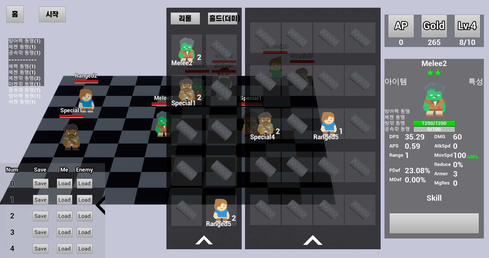

포트폴리오
=============
## 목차

1. [개요](#개요)
1. [소개](#소개)
1. [기술 스택](#기술-스택)    
    1. [Languages](#Languages)
    1. [Game Engines](#Game-Engines)
    1. [Tools](#Tools)
1. [게임 목록](#게임-목록)
    1. [Enoch](#1-Enoch)
    1. [FlatformLand](#2-FlatformLand)    
    1. [savethechickentower(BeyondtheSky)](#3-savethechickentower)
    1. [tentacles](#4-tentacles)
    1. [yubintest](#5-yubintest)

## 개요
* 포트폴리오 및 깃허브 리포지토리에 대한 설명입니다.
* 용량 문제로 인해, 첨부된 압축파일에는 언리얼 프로젝트 `Enoch`의 소스 코드와 포트폴리오만 첨부되어 있습니다. 
  전체 프로젝트는 [깃허브 리포지토리](https://github.com/kimyubin/Portfolio)에서 확인하실 수 있습니다.
* **PDF파일**과 **README.html**, **README.md**의 내용은 동일합니다.
* `1. Enoch_Source.zip` 파일 안에는 `Enoch 언리얼 프로젝트`의 소스 코드만 따로 첨부되어 있습니다.
* [포트폴리오 리포지토리 링크](https://github.com/kimyubin/Portfolio) (https://github.com/kimyubin/Portfolio) 
   

## 소개
* 이름 : 김유빈
* 학력 : 숭실대학교 국어국문학과/컴퓨터학부(복수전공) 졸업

* 전산학 지식
    * 기초 컴퓨터 과학 및 공학 수업을 이수했습니다. 
    ( 컴퓨터 구조, 운영체제, 자료구조, 알고리즘, 프로그래밍 언어론, 객체지향, 형식언어 및 오토마타, 선형대수학, 데이터 베이스, 네트워크 등 )
    * 기본적인 자료구조, 알고리즘을 이해하고 있고 레퍼런스를 참고하여 작성할 수 있습니다.
    * 컴퓨터의 기본 구조와 작동 메커니즘을 이해하고 있고, 이를 고려하여 코딩할 수 있습니다.

    * 객체지향
        * 캡슐화, 정보은닉, 상속 등 객체지향 설계 사상의 이유와 중요성을 이해하고 있습니다.
        * 객체의 추상화 수준을 높혀, 협업시 커플링이 적도록 할 수 있습니다.
        * 중복도가 높고 파편화된 코드를 상속관계로 정리할 수 있습니다.
        * 상속을 통해 객체의 책임을 분산시킬 수 있습니다.
* 개발
    * 팀 프로젝트에 꾸준히 참여하고 있습니다.
    * 유니티, 언리얼 엔진 등 상용 엔진을 익혔습니다.  
    * 구글 플레이 스토어에 게임을 출시한 경험이 있습니다.(`Beyond the Sky`)
<br><div style="page-break-after: always;"></div>

---
## 기술 스택

### Languages
* **C++**
    
    * 기본 문법을 이해하고 있으며, STL과 그에 포함된 컨테이너, 함수를 활용할 수 있습니다.
    * 라이브러리에 포함된 자료구조와 알고리즘의 구조를 파악하고 있으며, 이를 업무에 활용할 수 있습니다. 
    * Unreal Engine 개발에 사용할 수 있습니다.

* **C#**

    * 문법에 대한 기초적인 지식이 있습니다.
    * 유니티 스크립트 언어로 활용할 수 있습니다.
    
* **JAVA**
        
    * 기본 문법을 이해하고 활용할 수 있습니다.

### Game Engines
* **Unreal Engine**
    * 기본적인 기능 사용이 가능하고, 엔진 구조에 대한 개괄적인 이해를 갖추고 있습니다.
    * C++ 기반 프로그래밍이 가능합니다. 
    * UMG(UI)를 C++ 기반으로 개발할 수 있습니다.
    * UI에 3D 모델을 적용할 수 있습니다.
    * C++코드와 블루프린트의 차이를 이해하고 있고, 각자의 역할에 따라 사용할 수 있습니다.
    * 블루프린트로 짜여진 로직을 C++로 재구성할 수 있습니다. 
    * 엔진 코드를 참고하고, 구조를 파악하면서 코딩할 수 있습니다.
    * 현재 취미용 팀 프로젝트를 진행하고 있습니다.

* **Unity**
    * 기본적인 기능 활용 및 게임 개발이 가능합니다.
    * UGUI를 활용한 UI구성, 개발이 가능합니다.
    * 간단한 점프 게임을 구글 플레이 스토어에 출시한 경험이 있습니다.
        * 게임명 : `Beyond the Sky`
        * 폴더명 : `3. savethechickentower`

### Tools
* **Visual Studio Code** : 기본 코딩 및 Unity 개발용
* **Jetbrains Rider(for Unreal Engine)** : 언리얼 엔진 개발용
* **Visual Studio 2022** : 언리얼 엔진 개발용
* **Sourcetree** : GUI기반 Git 버전관리 프로그램

<br><br><div style="page-break-after: always;"></div>

----------------------------------------------------------------

## 게임 목록
* 최근 프로젝트부터 역순으로 정렬되어 있습니다. 항목명은 폴더명을 기준으로 작성되어져 있습니다.
* Enoch 프로젝트는 현재 진행 중입니다.
* ```savethechickentower``` 폴더는 실제 발매된 게임의 이름과 폴더명이 상이합니다. 실제 발매된 게임은 `BeyondtheSky(하늘 너머로)`입니다.

<br>

### 1. Enoch
</img>
</img><br>

**[실행 예시 유튜브 영상 링크](https://youtu.be/NPYjiZS8pZE)** | https://youtu.be/NPYjiZS8pZE

|프로젝트 명|Enoch|
|:---|:---|
|유형|언리얼 엔진 팀 프로젝트|
|개발 인원|기획 1명, 클라이언트 프로그래머 2명, 서버 프로그래머 2명|
|개발 목적|취미|
|담당 영역 | UI, Drag&Drop 용병 구매/판매/배치/합성, 적풀, 데이터 저장/불러오기, 게임모드 등|
|엔진 버전|Unreal Engine 4.27.2|

<br>

* **설명**
    * 오토체스류 게임(오토배틀러)
        * 비동기 기반 오토체스 게임을 목표로 만들고 있습니다.
        * 상점에서 용병이 등장할 확률은, 같은 게임에 있는 플레이어 기반이 아닌 이전에 플레이했던 기록을 바탕으로 생성된 적들의 풀(이하 적풀. Enemy Pool)을 기반으로 정해집니다.
        * 각 9명으로 이루어진 적풀 3개 중 1개를 플레이어가 고르면, 이를 바탕으로 상점이 구성될 예정입니다.
        * 현재 생성되는 적풀의 구성은 모두 랜덤입니다.
    * 폴더 안에는 서버 코드와 언리얼 엔진 코드가 모두 포함되어져 있습니다.
        * 언리얼 엔진 파트는 ```\Portfolio\1. Enoch\Code\Enoch```하위 폴더에 위치해 있습니다.
        * 지원자 구현 코드는 ```\Portfolio\1. Enoch\Code\Enoch\Source\Enoch```에 위치해 있습니다.
    * 개발 진행 중인 프로젝트
<br>

* **지원자 구현 목록**
    * 메인 화면 및 각 레벨 간 이동
    * 시스템
        * GameModeBase, PlayerController, DefaultPawn 등 각 레벨별 월드 세팅
        * SceneCapture 3D UI
        * 테스트를 위한 필드 용병 저장 및 불러오기
    * 적풀 전체
        * 적풀 선택화면 UI
        * 적풀 내부 용병 정보 처리 로직
        * 리롤, 선택 등 내부 로직
        * 적풀 선택 후 적 용병의 필드 스폰
    * 상점, 인벤토리 및 Drag&Drop 기능 전체
        * 상점, 인벤토리 내부 로직
        * 상점, 인벤토리 간 용병의 구매/판매
        * 델리게이트 바인딩을 통한 필드 용병의 Drag&Drop 배치/재배치/회수        
        * 용병 구매 시, 필드/인벤토리에 있는 용병 자동 합성
    * 저장, 체력바, 사망 판정, 전투 결과 UI 구현(우측 골드/레벨 창 및 용병 정보창 제외)
        * 필드 데이터 저장 및 로드(스폰)(좌하단 UI)
    * 마우스 휠을 통한 카메라 각도 조정 및 필드 용병 각도 조정<br>

* **구현 소스 목록**(`\Source\`)    
    ><b id="fn1">A.</b> 해당 파일은 다음 항목만 구현했습니다. [↩](#f1)       
    ><b id="fn2">B.</b> 해당 파일은 다음 항목을 제외하고 나머지 부분을 구현했습니다. [↩](#f2)

    |\Enoch|\Enoch\UIs|\Enoch\Commons|
    |:---|:---|:---|
    |CommanderWrapper|EnemyPoolDetailSlot|Commander<sup id="f2">[B](#fn2)</sup>|
    |DragImage|EnemyPoolDetailsPanel|`- EnochCommander()`|
    |EnochDragDropOP|EnemyPoolPanel|`- uint32 addExp(uint32)`|
    |EnochField<sup id="f1">[A](#fn1)</sup>|EnochFightResultUI|`- uint16 getExpForNextLevel(uint8) `|
    |`- GenerateField()`|FieldDragDetector|`- uint16 getMaxFreeLancerNumber(uint8)`|
    |EnochFieldDropProtector|FreeLancerDeathUI||
    |EnochFieldSaveSlot|FreeLancerUnifiedUpperUI||
    |EnochFreeLancer<sup id="f1">[A](#fn1)</sup>|PlayMenuUIManager||
    |`- UI 컴포넌트`|SelectEnemyPoolUI||
    |`- RotatorSetforCamera()`|UniformSlot||
    |`- SetDragDetectOnOff(bool)`|||
    |`- SetImageVisualOnOff(bool)`|||
    |EnochGameModeBase|||
    |EnochGameModeBaseEnemyPool|||
    |EnochGameModeBasePlay|||
    |EnochGameModeBaseStart|||
    |EnochMouseController|||
    |EnochSaveField|||
    |EnochSaveGameState|||
    |PlayDefaultPawn|||

<br><br><div style="page-break-after: always;"></div>

### 2. FlatformLand
</img>
</img>


|프로젝트 명|FlatformLand|
|:---|:---|
|유형|유니티 개인 프로젝트|
|개발 인원|1명|
|개발 목적|취미|
|엔진 버전 | Unity 2019.3.0f3|

* **설명**
    * 로프를 이용한 2D 플랫포머 게임    
* **지원자 구현 목록**
    * 자연스러운 안티 에일리어싱을 위해 3D 모델로 구현
    * 로프 조준(c키), 로프 발사 및 당김(v키)
    * 장애물에 대한 로프 꺽임 구현.
    * 유니티 애니메이션이 아닌, FSM를 통한 캐릭터 애니메이션 구현(오브젝트를 직접 회전 시키는 방식)
    * 사망 판정 및 부활

<br><br><div style="page-break-after: always;"></div>

### 3. savethechickentower
</img>
</img>

**[플레이 영상 유튜브 링크](https://youtu.be/IIDG5cgJkTY)** | https://youtu.be/IIDG5cgJkTY

|프로젝트 명|BeyondtheSky(하늘 너머로)|
|:---|:---|
|유형|유니티 개인 프로젝트|
|개발 인원|1명|
|개발 목적| 구글 플레이 스토어 출시 |
|엔진 버전 | Unity 2019.3.0f3|
|다운로드 링크|[구글 플레이스토어](https://play.google.com/store/apps/details?id=com.KimFriedChicken.beyondthesky)|


* **설명**
    * 초기 컨샙이 변경되어 폴더명과 실제 프로젝트명이 다릅니다.
    * 두들 점프와 비슷한 점프 게임이며, 어린왕자와 사막 여우 이야기를 각색했습니다.
* **구현 목록**
    * 기울기 센서 대신 터치로 좌우 이동
    * 플랫폼(발판) 및 아이템 자동 생성 구현
    * 게임 오버, 클리어, 최고 기록, 중간저장 기능 구현
    * Json 기반 암호화된 데이터 저장 구현
    * 광고 삽입
    * 세팅 메뉴 및 기타 UI 구현

<br><br><div style="page-break-after: always;"></div>

### 4. tentacles
</img>
</img>

|프로젝트 명|tentacles|
|:---|:---|
|유형|유니티 팀 프로젝트|
|개발 인원|기획 1명, 프로그래밍 2명|
|개발 목적|취미|
|담당 영역 | 캐릭터 스킬 일부, UI, 맵, 시스템 기능 프로그래밍|
|엔진 버전 | Unity 2019.1.0f2|

* **설명**
    * 2D 플랫포머 게임
* **지원자 구현 목록**
    * 픽셀 퍼펙트/시네머신을 사용해 자연스러운 화면과 카메라 워크 적용
    * 맵 전체 구현
    * UI 전체 구현
    * 시스템 기능 구현
        * 저장/불러오기(Json 기반)
        * 화면 전환/게임 종료
        * 일시정지(ESC) 및 메뉴 화면       
    * 플레이어 캐릭터 스킬 일부 구현
        * 상하 버튼으로 상하 시야 확보
        * 촉수 점프(c키). 공중 혹은 벼랑 끝에서 원거리 점프 가능.
        * 다리(bridge) 아래로 통과. 점프키(z)+↓키로 통과.
        * 체력 관리
        * 스킬 습득 시스템

<br><br>

### 5. yubintest
</img>

|프로젝트 명|yubintest|
|:---|:---|
|유형|유니티 개인 프로젝트|
|개발 인원|1명|
|개발 목적|유니티 입문 공부용 프로젝트|
|엔진 버전 | Unity 2018.3.2f1|
* **설명**
    * 2D 플랫포머 게임
* **구현 목록**
    * 픽셀 퍼펙트/시네머신을 사용해 자연스러운 화면과 카메라 워크 적용
    * 플레이어 
        * 근거리/대시/원거리 공격(X, Z키), 점프(Space), 벽 점프, 벽 고정(Shift), 피격 구현        
    * 몬스터 
        * 순찰, 플레이어 감지, 원거리 공격 구현


