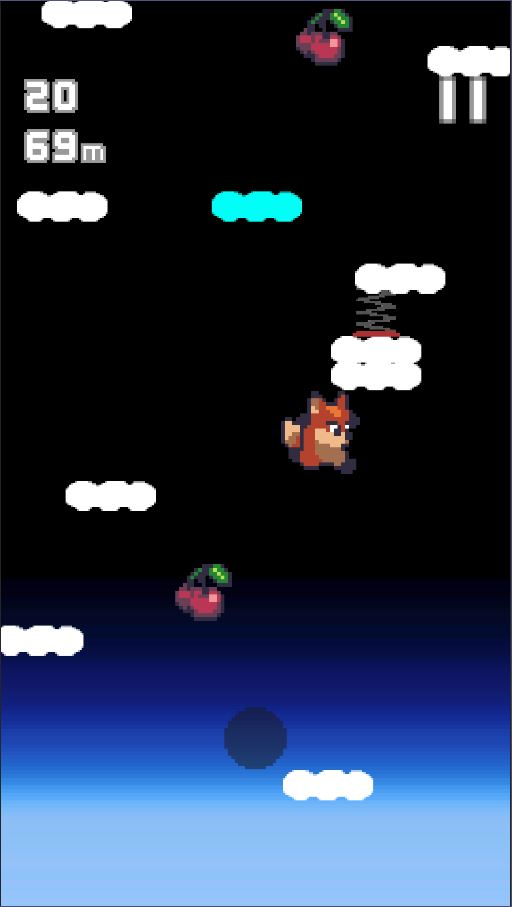

포트폴리오
=============
## 목차

1. [개요](#개요)
1. [기술 스택](#기술-스택)
    1. [Languages](#Languages)
    2. [Game Engines](#Game-Engines)
    3. [Tools](#Tools)
1. [게임 목록](#게임-목록)
    1. [Enoch](#1-Enoch)
    1. [FlatformLand](#2-FlatformLand)    
    1. [savethechickentower](#3-savethechickentower)
    1. [tentacles](#4-tentacles)
    1. [yubintest](#5-yubintest)

## 개요
* 포트폴리오 자료용 깃허브 리포지토리 및 설명 입니다.
* **PDF파일**과 **README.md**의 내용은 동일합니다.
* [포트폴리오 리포지토리 링크](https://github.com/kimyubin/Portfolio)      
## 기술 스택

### Languages
* **C++**
    
    * 기본 문법을 이해하고 있으며, 표준 라이브러리와 그에 포함된 컨테이너를 활용할 수 있습니다.
    * Unreal Engine 개발에 사용할 수 있습니다.

* **C#**

    * 문법에 대한 기초적인 지식이 있습니다.
    * 유니티 스크립트 언어로 활용할 수 있습니다.
    
* **JAVA**
        
    * 기본 문법을 이해하고 있습니다.

### Game Engines
* **Unity**
    * 기본적인 기능 활용 및 게임 개발이 가능합니다.
    * UGUI를 활용한 UI구성, 개발이 가능합니다.
    * 간단한 점프 게임을 구글 플레이 스토어에 출시한 경험이 있습니다.

* **Unreal Engine**
    * 기본적인 기능 사용이 가능하고, 엔진 구조에 대한 개괄적인 이해를 갖추고 있습니다.
    * C++ 기반 프로그래밍이 가능합니다. 
    * UMG(UI)를 C++ 기반으로 개발할 수 있습니다.
    * 블루프린트로 짜여진 로직을 C++로 재구현할 수 있습니다.
    * 현재 취미용 팀프로젝트를 진행하고 있습니다.


### Tools
* **Visual Studio Code** : 기본 코딩 및 Unity 개발용
* **Jetbrains Rider(for Unreal Engine)** : 언리얼 엔진 개발용
* **Visual Studio 2022** : 언리얼 엔진 개발용
* **Sourcetree** : GUI기반 Git 버전관리 프로그램

----------------------------------------------------------------

## 게임 목록
* 개발 시기 역순으로 정렬되어 있습니다. 항목명은 폴더명을 기준으로 작성되어져 있습니다.
* Enoch 프로젝트는 현재 진행 중입니다.
* ```savethechickentower```는 실제 발매된 게임의 이름과 폴더명이 상이합니다.
### 1. Enoch
</img>
</img>

|프로젝트 명|Enoch|
|:---|:---|
|유형|언리얼 엔진 팀 프로젝트|
|개발 인원|기획 1명, 클라이언트 프로그래머 2명, 서버 프로그래머 2명|
|개발 목적|취미|
|담당 영역 | UI, Drag&Drop 용병 구매/판매/배치/합성, 데이터 저장/불러오기|
|엔진 버전|Unreal Engine 4.27.2|

* **설명**
    * 오토체스류 게임(오토배틀러)
        * 비동기 기반 오토체스 게임을 목표로 만들고 있습니다.
        * 상점에서 용병이 등장할 확률은, 같은 게임에 있는 플레이어 기반이 아닌 이전에 플레이했던 기록을 바탕으로 생성된 적들의 풀(이하 적풀. Enemy Pool)을 기반으로 정해집니다.
        * 각 9명으로 이루어진 적풀 3개 중 1개를 플레이어가 고르면, 이를 바탕으로 상점이 구성될 예정입니다.
        * 현재 생성되는 적풀의 구성은 모두 랜덤입니다.
    * 폴더 안에는 서버 코드와 언리얼 엔진 코드가 모두 포함되어져 있습니다.
        * 언리얼 엔진 파트는 ```\Portfolio\1. Enoch\Code\Enoch```하위 폴더에 위치해 있습니다.
        * 언리얼 엔진에서 구동되는 소스는 ```\Portfolio\1. Enoch\Code\Enoch\Source\Enoch```에 위치해 있습니다.
    * 개발 진행 중

* **지원자 구현 목록**
    * 메인 화면 및 각 레벨 간 이동
    * 적풀 전체
        * 적풀 선택화면 UI
        * 적풀 내부 용병 정보 처리 로직
        * 리롤, 선택 등 내부 로직
        * 적풀 선택 후 적 용병의 필드 스폰
    * 상점, 인벤토리 및 Drag&Drop 기능 전체
        * 상점, 인벤토리 내부 로직
        * 상점, 인벤토리 간 용병의 구매/판매
        * 필드 용병의 Drag&Drop 배치/회수
        * 용병 구매 시, 필드/인벤토리에 있는 용병 자동 합성 구현.

    * 저장, 체력바, 사망 판정, 전투 결과 UI 구현(우측 골드/레벨 창 및 용병 정보창 제외)
        * 필드 데이터 저장 및 로드(스폰)(좌하단 UI)
    * 마우스 휠을 통한 카메라 각도 조정 및 필드 용병 각도 조정
    <br>
    * 구현 소스 목록(`\Source\`)
        |\Enoch|\Enoch\UIs|\Enoch\Commons|
        |:---|:---|:---|
        |CommanderWrapper|EnemyPoolDetailSlot|Commander(일부 제외)|
        |DragImage|EnemyPoolDetailsPanel|`- EnochCommander()`|
        |EnochDragDropOP|EnemyPoolPanel|`- uint32 addExp(uint32)`|
        |EnochField(일부)|EnochFightResultUI|`- uint16 getExpForNextLevel(uint8) `|
        |`- GenerateField()`|FieldDragDetector|`- uint16 getMaxFreeLancerNumber(uint8)`|
        |EnochFieldDropProtector|FreeLancerDeathUI||
        |EnochFieldSaveSlot|FreeLancerUnifiedUpperUI||
        |EnochFreeLancer(일부)|PlayMenuUIManager||
        |`- UI 컴포넌트`|SelectEnemyPoolUI||
        |`- RotatorSetforCamera()`|UniformSlot||
        |`- SetDragDetectOnOff(bool OnOff)`|||
        |`- SetImageVisualOnOff(bool OnOff)`|||
        |EnochGameModeBase|||
        |EnochGameModeBaseEnemyPool|||
        |EnochGameModeBasePlay|||
        |EnochGameModeBaseStart|||
        |EnochMouseController|||
        |EnochSaveField|||
        |EnochSaveGameState|||
        |PlayDefaultPawn|||


### 2. FlatformLand
</img>
</img>


|프로젝트 명|FlatformLand|
|:---|:---|
|유형|유니티 개인 프로젝트|
|개발 인원|1명|
|개발 목적|취미|
|엔진 버전 | Unity 2019.3.0f3|

* **설명**
    * 로프를 이용한 2D 플랫포머 게임    
* **지원자 구현 목록**
    * 자연스러운 안티 에일리어싱을 위해 3D 모델로 구현
    * 로프 조준(c키), 로프 발사 및 당김(v키)
    * 장애물에 대한 로프 꺽임 구현.
    * 유니티 애니메이션이 아닌, FSM를 통한 캐릭터 애니메이션 구현(오브젝트를 직접 회전 시키는 방식)
    * 사망 판정 및 부활

### 3. savethechickentower
</img>
</img>
</img><br/>

|프로젝트 명|BeyondtheSky(하늘 너머로)|
|:---|:---|
|유형|유니티 개인 프로젝트|
|개발 인원|1명|
|개발 목적| 구글 플레이 스토어 출시 |
|엔진 버전 | Unity 2019.3.0f3|
|다운로드 링크|[구글 플레이스토어](https://play.google.com/store/apps/details?id=com.KimFriedChicken.beyondthesky)|

* **설명**
    * 초기 컨샙이 변경되어 폴더명과 실제 프로젝트명이 다릅니다.
    * 두들 점프와 비슷한 점프 게임이며, 어린왕자와 사막 여우 이야기를 각색했습니다.
* **구현 목록**
    * 기울기 센서 대신 터치로 좌우 이동
    * 플랫폼(발판) 및 아이템 자동 생성 구현
    * 게임 오버, 클리어, 최고 기록, 중간저장 기능 구현
    * Json 기반 암호화된 데이터 저장 구현
    * 광고 삽입
    * 세팅 메뉴 및 기타 UI 구현

### 4. tentacles
</img>
</img>

|프로젝트 명|tentacles|
|:---|:---|
|유형|유니티 팀 프로젝트|
|개발 인원|기획 1명, 프로그래밍 2명|
|개발 목적|취미|
|담당 영역 | 캐릭터 스킬 일부, UI, 맵, 시스템 기능 프로그래밍|
|엔진 버전 | Unity 2019.1.0f2|

* **설명**
    * 2D 플랫포머 게임
* **지원자 구현 목록**
    * 픽셀 퍼펙트/시네머신을 사용해 자연스러운 화면과 카메라 워크 적용
    * 맵 전체 구현
    * UI 전체 구현
    * 시스템 기능 구현
        * 저장/불러오기(Json 기반)
        * 화면 전환/게임 종료
        * 일시정지(ESC) 및 메뉴 화면       
    * 플레이어 캐릭터 스킬 일부 구현
        * 상하 버튼으로 상하 시야 확보
        * 촉수 점프(c키). 공중 혹은 벼랑 끝에서 원거리 점프 가능.
        * 다리(bridge) 아래로 통과. 점프키(z)+↓키로 통과.
        * 체력 관리
        * 스킬 습득 시스템

### 5. yubintest
</img>

|프로젝트 명|yubintest|
|:---|:---|
|유형|유니티 개인 프로젝트|
|개발 인원|1명|
|개발 목적|유니티 입문 공부용 프로젝트|
|엔진 버전 | Unity 2018.3.2f1|
* **설명**
    * 2D 플랫포머 게임
* **구현 목록**
    * 픽셀 퍼펙트/시네머신을 사용해 자연스러운 화면과 카메라 워크 적용
    * 플레이어 
        * 근거리/대시/원거리 공격(X, Z키), 점프(Space), 벽 점프, 벽 고정(Shift), 피격 구현        
    * 몬스터 
        * 순찰, 플레이어 감지, 원거리 공격 구현
    

 

    